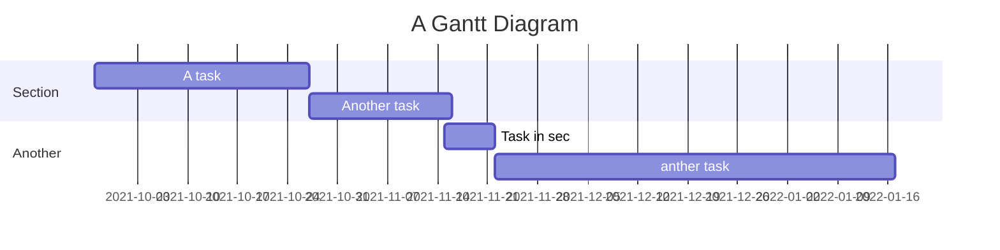



  
https://github.com/ja754969/Julia-Programming  
###### tags: `程式語言` `Julia` `git`
[How to sync with GitHub](https://hackmd.io/c/tutorials/%2Fs%2Flink-with-github)  
[如何與 GitHub 同步筆記](https://hackmd.io/c/tutorials-tw/%2Fs%2Flink-with-github-tw)  
# Julia Programming

## Project Timeline
---
https://mermaid-js.github.io/mermaid/#/gantt?id=a-note-to-users

