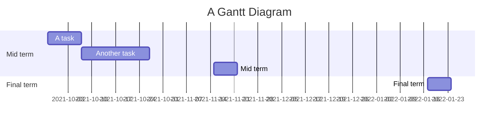



[](https://hackmd.io/GCbDZ6_xRLe4WPFTW_WPQg)  
https://github.com/ja754969/Julia-Programming  
###### tags: `程式語言` `Julia` `git`
[How to sync with GitHub](https://hackmd.io/c/tutorials/%2Fs%2Flink-with-github)  
[如何與 GitHub 同步筆記](https://hackmd.io/c/tutorials-tw/%2Fs%2Flink-with-github-tw)  
# Julia Programming

## Project Timeline
---
https://mermaid-js.github.io/mermaid/#/gantt?id=a-note-to-users

## The Manual & Document
https://docs.julialang.org/en/v1/
```
$ julia

               _
   _       _ _(_)_     |  Documentation: https://docs.julialang.org
  (_)     | (_) (_)    |
   _ _   _| |_  __ _   |  Type "?" for help, "]?" for Pkg help.
  | | | | | | |/ _` |  |
  | | |_| | | | (_| |  |  Version 1.6.2 (2021-07-14)
 _/ |\__'_|_|_|\__'_|  |  Official https://julialang.org/ release
|__/                   |


julia> 1 + 2
3

julia> ans
3
```
## For Beginner
### Get Started with Julia
https://julialang.org/learning/
### Julia on Exercism

https://exercism.org/tracks/julia
#### 1. Hello World
```julia=
function hello()
    return "Hello, World!"
end
```
#### 2. Leap Year
```
on every year that is evenly divisible by 4
  except every year that is evenly divisible by 100
    unless the year is also evenly divisible by 400
```
```julia=
"""
    is_leap_year(year)

Return `true` if `year` is a leap year in the gregorian calendar.

"""
function is_leap_year(year)
    if (year % 100 != 0 && year % 4 == 0) || (year % 400 == 0)
        return true
    else 
        return false
    end
end
```

### Coursera : julia-programming
https://www.coursera.org/learn/julia-programming/home/welcome